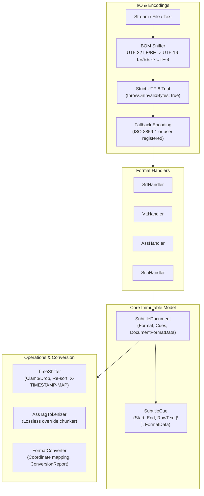

# SubtitleToolkit Technical Architecture

## 1. System Overview



## 2. Core Model Contracts

### `SubtitleDocument`
- Immutable container representing a parsed subtitle file.
- Encapsulates:
  - `SubtitleFormat Format`: Enum (`SubRip`, `WebVtt`, `Ass`, `Ssa`).
  - `IReadOnlyList<SubtitleCue> Cues`: Defensive copy in `ReadOnlyCollection<SubtitleCue>`.
  - `DocumentFormatData? FormatData`: Strongly typed document extension bag.
- Equality: Structural value equality across all cues and format data.

### `SubtitleCue`
- Immutable single subtitle event.
- Encapsulates:
  - `TimeSpan Start`: Cue start timestamp.
  - `TimeSpan End`: Cue end timestamp.
  - `TimeSpan Duration => End >= Start ? End - Start : TimeSpan.Zero`.
  - `string RawText`: Canonical cue text payload. All multiline text is strictly normalized to `\n` on construction.
  - `CueFormatData? FormatData`: Strongly typed cue extension bag.
  - `string PlainText`: Lazily computed on first access using `SubtitleTextHelper.ExtractPlainText(RawText, FormatData?.Format)`.

### Format Bags Hierarchy
```csharp
public abstract class CueFormatData
{
    public abstract SubtitleFormat Format { get; }
}

public abstract class DocumentFormatData
{
    public abstract SubtitleFormat Format { get; }
}
```

- **ASS Bags**:
  - `AssCueData : CueFormatData`: `AssEventType Type`, `int Layer`, `string StyleName`, `string ActorName`, `int MarginL`, `int MarginR`, `int MarginV`, `string Effect`.
  - `AssDocumentData : DocumentFormatData`: `IReadOnlyDictionary<string, string> ScriptInfo`, `IReadOnlyList<AssStyle> Styles` (preserving `Format:` field order), `IReadOnlyList<RawAssSection> UnknownSections`.
- **WebVTT Bags**:
  - `VttCueData : CueFormatData`: `string? Identifier`, `string RawSettings`, `VttCueSettings Settings`.
  - `VttDocumentData : DocumentFormatData`: `string? HeaderComment`, `string? TimestampMap`, `IReadOnlyList<VttAnchoredBlock> NonCueBlocks` (anchored via `BeforeCueIndex` so `NOTE`, `STYLE`, and `REGION` blocks preserve exact document position).

## 3. Resilient Encoding Pipeline

When reading an input stream:
1. Sniff the first 4 bytes:
   - `FF FE 00 00` -> UTF-32 LE
   - `00 00 FE FF` -> UTF-32 BE
   - `FF FE` -> UTF-16 LE
   - `FE FF` -> UTF-16 BE
   - `EF BB BF` -> UTF-8 BOM
2. If no BOM is identified, attempt strict UTF-8 decoding:
   ```csharp
   new UTF8Encoding(encoderShouldEmitUTF8Identifier: false, throwOnInvalidBytes: true)
   ```
3. If `DecoderFallbackException` is thrown, rewind the stream and decode using `SubtitleReadOptions.FallbackEncoding` (defaults to `ISO-8859-1` / Latin-1). Invalid bytes are thus preserved rather than permanently destroyed into `U+FFFD`.

## 4. Diagnostics & Safety Contract

### Parsing Diagnostics
- `ParseResult` contains `SubtitleDocument Document` and `IReadOnlyList<ParseDiagnostic> Diagnostics`.
- `ParseMode.Lenient`: Recovers from missing index numbers, malformed timestamps, or unescaped characters, logging warnings to diagnostics.
- `ParseMode.Strict`: Throws `SubtitleParseException` on the first unrecoverable error.

### Save vs. Convert Boundary
- `Subtitle.Save(doc, path, targetFormat)` enforces:
  ```csharp
  if (targetFormat != doc.Format)
      throw new InvalidOperationException($"Cannot save document of format {doc.Format} directly as {targetFormat}. Use Subtitle.Convert() for explicit format conversion.");
  ```
- Format conversion is performed only through `Subtitle.Convert(doc, targetFormat, options)`, which returns a `ConversionResult` containing `SubtitleDocument` and a machine-readable `ConversionReport`.
