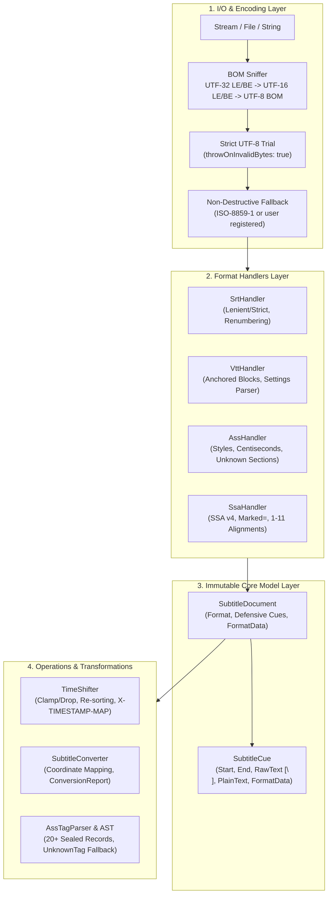

# SubtitleToolkit Architecture, Design Decisions & Limitations

This document details the internal architecture, design principles, Architecture Decision Records (ADRs), performance characteristics, and deliberate technical boundaries of **SubtitleToolkit**.

---

## 1. System Architecture & Component Design



### Layer Responsibilities

1. **I/O & Encodings**: Resolves file, stream, and byte inputs with zero character corruption. Employs byte sniffing followed by strict UTF-8 verification and non-destructive Latin-1 fallback.
2. **Format Handlers**: Stateless implementations of [`ISubtitleHandler`](../src/SubtitleToolkit/Formats/ISubtitleHandler.cs). Each handler parses raw content into structured cues and serializes documents to standard text writers.
3. **Immutable Core Model**: Sealed containers ([`SubtitleDocument`](../src/SubtitleToolkit/Model/SubtitleDocument.cs) and [`SubtitleCue`](../src/SubtitleToolkit/Model/SubtitleCue.cs)) with defensive copying on construction. Format-specific metadata is isolated inside typed bags ([`CueFormatData`](../src/SubtitleToolkit/Model/FormatData/CueFormatData.cs) and [`DocumentFormatData`](../src/SubtitleToolkit/Model/FormatData/DocumentFormatData.cs)).
4. **Operations & Transformations**: High-level engines for offset time-shifting, bidirectional format translation, coordinate space projection, and ASS Abstract Syntax Tree manipulation.

---

## 2. Architecture Decision Records (ADRs)

### ADR 01: Zero-Dependency Mandate
- **Context**: Consumer applications range from Unity games (Mono & IL2CPP) and serverless AWS Lambdas / Azure Functions to microservices and desktop applications. Third-party NuGet dependencies cause version diamond conflicts, bloat deployment binaries, and complicate Ahead-of-Time (AOT) trimming.
- **Decision**: Target `netstandard2.0` and `net8.0` with **0 runtime NuGet dependencies**. Polyfills (`PolySharp`, `Microsoft.CodeAnalysis.PublicApiAnalyzers`) are configured with `PrivateAssets="all"` to prevent leakage into consumer dependency graphs.
- **Consequences**: Standard BCL collections (`ReadOnlyCollection<T>`, arrays, standard dictionaries) are used rather than `System.Collections.Immutable`.

### ADR 02: Single Source of Truth in `SubtitleCue.RawText`
- **Context**: Subtitle libraries often store `RawText`, `PlainText`, and parsed AST elements simultaneously. When users mutate one property, the others drift, leading to desynchronization bugs.
- **Decision**: `SubtitleCue.RawText` is the sole canonical source of truth. `PlainText` is lazily derived from `RawText` on first access according to the cue's format rules. Voice tags `<v Speaker>` remain inline inside `RawText`.
- **Consequences**: No dual-state drifting can occur. AST structures are created on-demand via `AssDialogueAst.Parse(...)`.

### ADR 03: Internal Linebreak Normalization
- **Context**: Subtitle files in the wild mix Windows CRLF (`\r\n`), Unix LF (`\n`), and legacy Mac CR (`\r`). Comparing cues parsed across different operating systems leads to false equality failures.
- **Decision**: All incoming multiline text in `SubtitleCue.RawText` is normalized strictly to `\n` upon construction:
  ```csharp
  RawText = rawText.Replace("\r\n", "\n").Replace('\r', '\n');
  ```
- **Consequences**: Internal text comparison is deterministic. Serialization output line endings are governed exclusively by `SubtitleWriteOptions.LineEnding` (default `\r\n`).

### ADR 04: Strict Separation of SSA v4.00 vs ASS v4.00+
- **Context**: SubStation Alpha v4.00 (SSA) and Advanced SubStation Alpha v4.00+ (ASS) share similar block headers (`[Events]`), but diverge fundamentally in layout semantics. SSA uses `[V4 Styles]`, `Marked=` (instead of `Layer`), and 1–11 alignments. ASS uses `[V4+ Styles]`, `Layer`, and 1–9 numpad alignments. Conflating them corrupts alignment positioning and event layering.
- **Decision**: Treat SSA (`SubtitleFormat.Ssa`) and ASS (`SubtitleFormat.Ass`) as distinct formats with separate handlers and explicit conversion rules.

### ADR 05: Lossless WebVTT Non-Cue Block Anchoring
- **Context**: WebVTT allows `NOTE`, `STYLE`, and `REGION` blocks anywhere in the file—including interspersed between dialogue cues. Moving all non-cue blocks to the file header destroys the author's visual commentary structure.
- **Decision**: Store non-cue blocks in `VttDocumentData.NonCueBlocks` as [`VttAnchoredBlock`](../src/SubtitleToolkit/Model/FormatData/VttAnchoredBlock.cs) records, tracking their position via `BeforeCueIndex`.
- **Consequences**: Writing a WebVTT file preserves the exact placement of inter-cue comments and styles.

### ADR 06: Save Safety Boundary & Conversion Audit Reports
- **Context**: Cross-format conversion (e.g. ASS to SRT) is inherently lossy. Dropping vector drawings, positioning coordinates, or font colors silently produces broken presentations.
- **Decision**: `Subtitle.Save` strictly forbids saving a document as a different format and throws `InvalidOperationException`. Conversions require `Subtitle.Convert` and return a structured `ConversionReport` cataloging all adapted or dropped features. Default `PlayRes` when omitted is strictly `384x288` per libass specifications.

### ADR 07: Sealed Record AST with `UnknownTag` Fallback
- **Context**: The ASS format has dozens of standard tags, plus proprietary extensions introduced by Aegisub and custom rendering pipelines. A rigid enum or hardcoded parser drops unknown tags during serialization.
- **Decision**: Model override tags as sealed C# records deriving from abstract `AssTag`. Any unrecognized tag syntax parses into [`UnknownTag(TagName, RawArgs)`](../src/SubtitleToolkit/Formats/AssTags.cs#L254), guaranteeing 100% round-trip preservation.

---

## 3. Performance & Memory Profile

### Allocation Characteristics
- **Zero Third-Party Allocations**: Pure BCL execution guarantees predictable GC behavior in serverless containers and high-throughput video pipelines.
- **Lazy PlainText Computation**: `PlainText` is computed only when requested by search, sanitization, or display routines.
- **Span-Friendly Parsing**: Substring operations and parsing routines minimize temporary string allocations during timestamp parsing.

### Comparative Benchmark Positioning

| Feature / Metric | **SubtitleToolkit** | **libse (Subtitle Edit Core)** | **SubtitlesParser** |
| :--- | :--- | :--- | :--- |
| **Footprint** | Lightweight (~100 KB DLL) | Large monolith (Desktop legacy) | Lightweight |
| **Dependencies** | **0** | Multiple external dependencies | 0 |
| **Target Frameworks** | `netstandard2.0`, `net8.0` | `.NET Framework` / Desktop | `netstandard2.0` |
| **AOT / Trimming** | Fully Trim-Safe / AOT Ready | Incompatible with native AOT | Partially Trim-Safe |
| **Model State** | **Immutable** | Mutable state | Mutable POCO |
| **Round-Trip Fidelity** | **100% Lossless** | Lossy on custom blocks | Drops all styles/headers |
| **ASS Section Retention** | Preserves unknown sections verbatim | Partial | Drops unknown sections |
| **Data Loss Auditing** | Structured `ConversionReport` | None | None |
| **ASS AST** | 20+ Typed Sealed Records | Regex string manipulation | None (dialogue text only) |

---

## 4. Technical Limitations & Non-Goals

To maintain high performance, reliability, and zero dependencies, `SubtitleToolkit` establishes explicit non-goals:

### 1. No Video Rendering or Rasterization
- `SubtitleToolkit` parses and manipulates subtitle text and metadata. It does **not** rasterize font glyphs, calculate font kerning curves, or burn subtitle bitmaps onto video frames.
- *Recommended Integration*: Use [`libass`](https://github.com/libass/libass) or `FFmpeg` for visual subtitle rendering and burn-in.

### 2. No Media Container Muxing / Demuxing
- The library does not parse binary media containers (`.mkv`, `.mp4`, `.ts`, `.m2ts`).
- *Recommended Integration*: Extract subtitle streams via `FFmpeg` or `MediaInfo`, process the subtitle streams with `SubtitleToolkit`, and remux if necessary.

### 3. No HLS / MPEG-DASH Fragment Chunking
- While `SubtitleToolkit` parses and recalculates MPEG-TS `X-TIMESTAMP-MAP` timing offsets, it does not chunk WebVTT streams into fragmented `.m4s` segments or generate `.m3u8` master playlists.

### 4. No Obsolete Binary Subtitle Formats in Core
- Legacy binary formats such as SAMI, MicroDVD, PAC, EBU STL, and CEA-608/708 binary closed captions are excluded from v1.x core to prevent bloat and maintain a 0-dependency standard.

### 5. No Vector Curve Geometry Evaluation
- Vector drawing commands (`\p1 ... \p0`) and clipping boundaries (`\clip`) are parsed into structured AST tokens (`DrawingTag`, `ClipTag`), but the library does not evaluate bezier curve geometry or execute 2D raster clipping.
